# 비자부기 핵심 기능 플로우 상세 설명

이 문서는 실제 모바일 기기에서 `visa-bugi-web` 앱을 실행해 캡처한 스크린샷을 근거로, 로그인부터 서류 준비까지의 화면 흐름과 각 기능을 설명한다. 사업계획서 3부(기획 세부설명) Part1의 확장판으로, 케이스별 라우팅과 컴포넌트 동작을 실제 화면과 함께 정리했다.

---

## 1. 로그인 페이지

시작 화면은 세 개의 버튼으로 진입 경로를 나눈다.

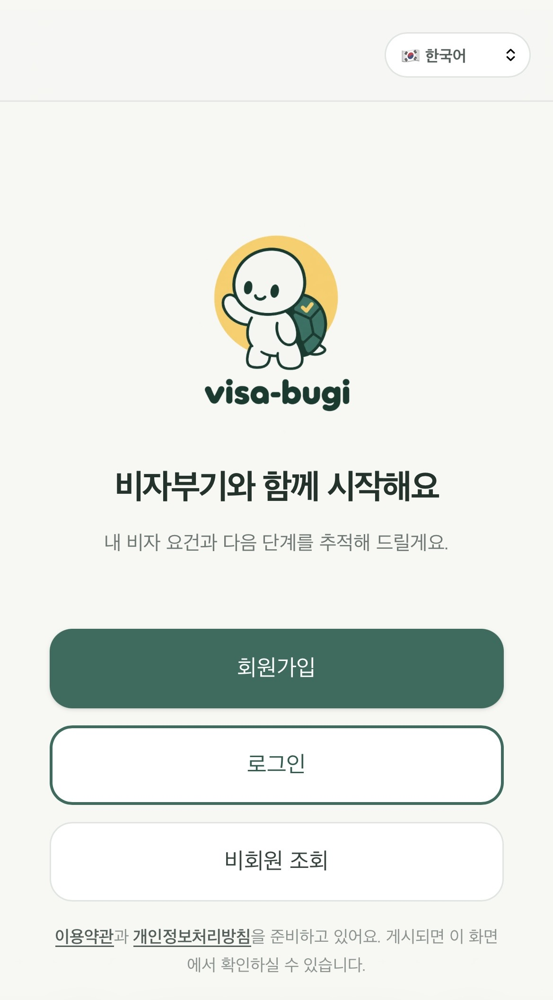

| 버튼 | 눌렀을 때 화면 | 라우팅 결과 |
|---|---|---|
| 회원가입 | 아이디·이름·비밀번호 입력 폼 | 입력 완료 후 온보딩 화면으로 이동 |
| 로그인 | 아이디·비밀번호 입력 폼 | 온보딩 완료 이력이 있으면 홈으로, 없으면 온보딩으로 이동 |
| 비회원 조회 | 별도 폼 없음 | 회원가입 없이 게스트 모드로 캘린더 등 일부 기능을 먼저 확인 가능 |

**Case 1 — 회원가입**

아이디(영문 소문자·숫자·밑줄 3~30자)·이름·비밀번호(8자 이상)를 입력한다.

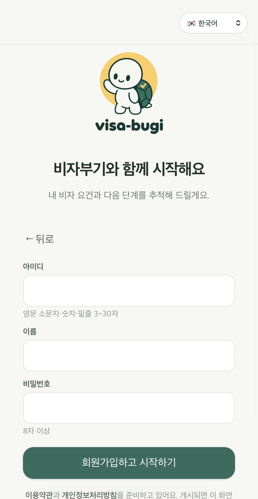
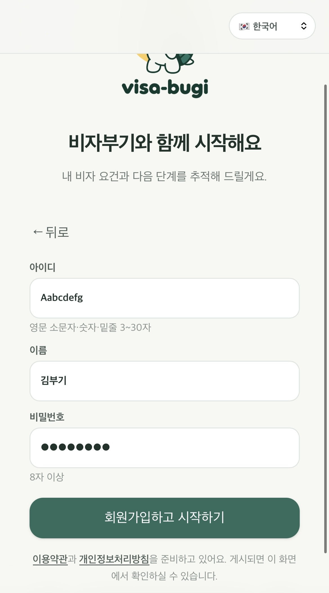

"회원가입하고 시작하기"를 누르면 계정이 생성되고 곧바로 온보딩 화면으로 이동한다. 회원가입·로그인 직후 로그인 화면이 다시 뜨는 문제를 없애고 온보딩으로 바로 연결하도록 별도로 수정된 동작이다.

**Case 2 — 로그인**

기존 아이디·비밀번호로 로그인한다.

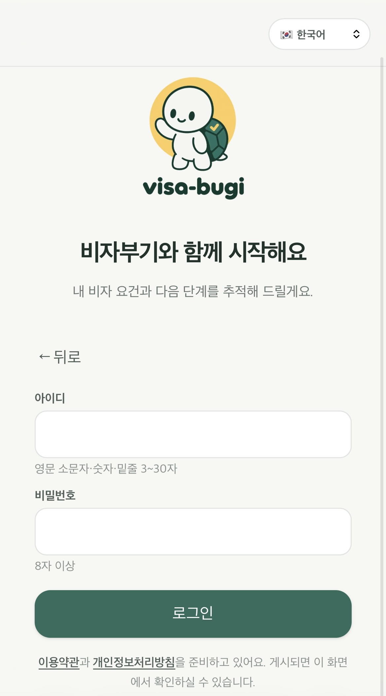

로그인에 성공하면 온보딩을 이미 마친 사용자는 홈 화면으로, 아직 마치지 않은 사용자는 온보딩 화면으로 이동한다.

**Case 3 — 비회원 조회**

계정을 만들지 않고도 캘린더 등 게스트용 화면으로 서비스를 미리 둘러볼 수 있다. 다만 이 경우 개인화된 준비 현황·서류 진행률 같은 계정 기반 기능은 이용할 수 없다.

---

## 2. 온보딩

회원가입 직후 시작되는 질문형 온보딩이다. 화면 상단 진행바로 남은 단계를 보여준다.

**질문 1 — 어떤 언어가 편한가요?**

한국어·中文·Tiếng Việt·O'zbekcha·नेपाली·ខ្មែរ 6개 언어 중 하나를 고른다. 이후 앱 전체 화면이 선택한 언어로 표시된다(7번 "번역 기능" 참고).

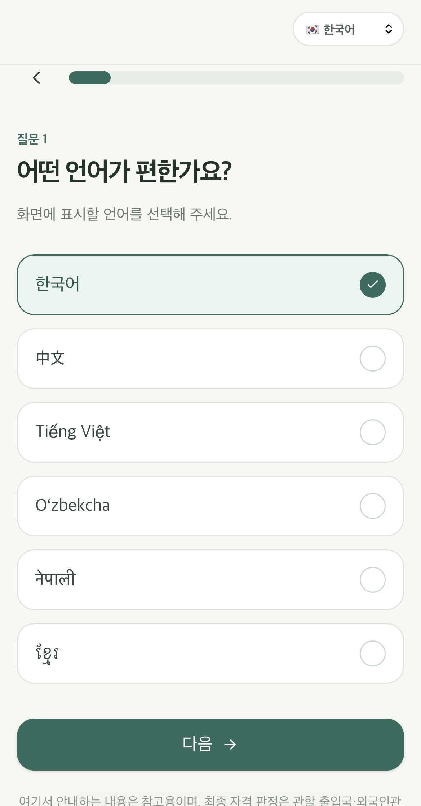

**질문 2 — 국적을 선택해 주세요**

베트남·우즈베키스탄·네팔·캄보디아·중국·기타 중에서 선택한다. 맞춤 안내를 준비하는 데 사용된다.

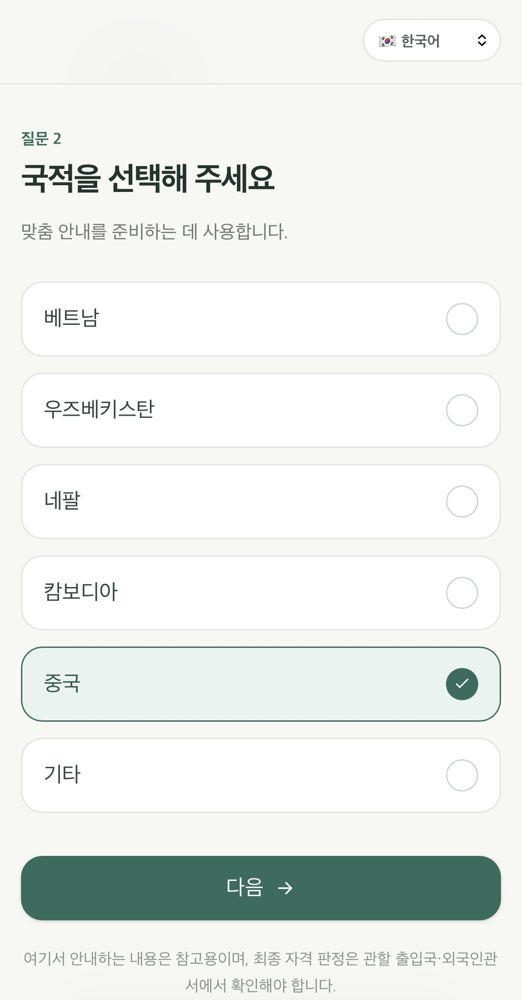

이어서 생년월일·주소·한국어능력(TOPIK/KIIP)·현재 체류자격 등을 단계별로 입력받는다. 마지막에 입력된 현재 체류자격을 근거로 목표 비자 후보를 규칙 기반으로 추천하고, 그 결과가 홈 화면의 "준비 현황" 카드로 이어진다. 화면 하단에는 "여기서 안내하는 내용은 참고용이며, 최종 자격 판정은 관할 출입국·외국인관서에서 확인해야 합니다"라는 안내 문구가 모든 온보딩 화면에 공통으로 표시된다.

---

## 3. 홈 화면

### 상단 카드 컴포넌트

홈 상단에는 사용자가 온보딩에서 고른(또는 선택 중인) 비자의 모집 현황 카드가 캐러셀로 표시된다.

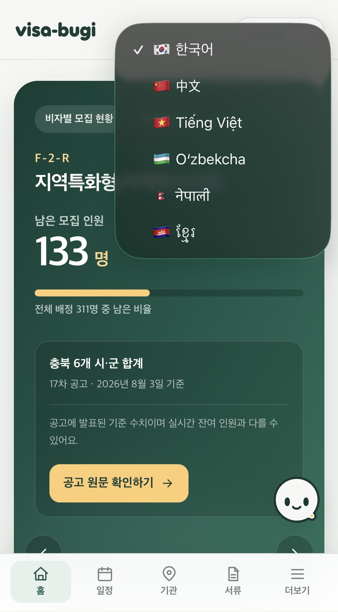

카드에는 "남은 모집 인원 133명 / 전체 배정 311명 중 남은 비율"처럼 실제 공고 수치가 진행률 막대와 함께 표시되고, "공고 원문 확인하기" 버튼으로 원본 공고까지 바로 연결된다. 카드 하단에는 "공고에 발표된 기준 수치이며 실시간 잔여 인원과 다를 수 있어요"라는 고지 문구가 항상 붙는다. 우측 상단 언어 선택기를 누르면 이 카드를 포함한 화면 전체가 즉시 다른 언어로 바뀐다(우즈베크어 예시는 7번 참고).

### 준비 현황 카드

온보딩에서 선택한 관심 비자 기준으로 전체 준비 진행률을 원형 그래프로 보여준다.

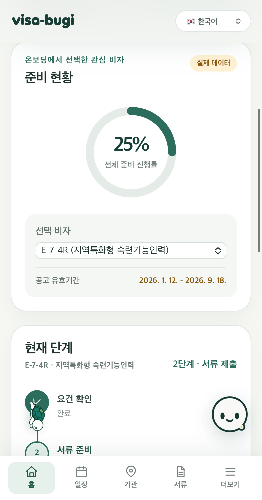

카드 우측 상단에는 "실제 데이터" 배지가 붙어, 이 진행률이 임의 값이 아니라 선택한 비자(E-7-4R 등)의 공고 유효기간과 실제 서류 체크 현황을 근거로 계산된 값임을 화면에서 직접 표시한다. 이 진행률은 5번 "서류 화면"에서 사용자가 체크한 서류 수에 따라 실시간으로 바뀐다.

### 현재 단계 컴포넌트

선택한 비자의 전체 절차를 "요건 확인 → 서류 준비 → 기관 방문 → 결과 확인" 4단계 타임라인으로 보여준다.

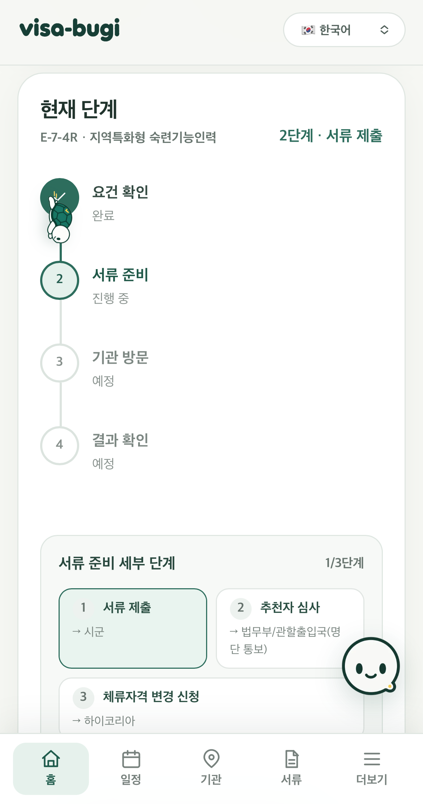

지금 사용자가 위치한 단계 옆에 앱 캐릭터(부기)가 표시되며, [서류 화면]에서 필수 서류가 모두 체크되면 다음 단계로 넘어가면서 캐릭터도 함께 이동한다. "서류 준비" 단계를 누르면 세부 단계(① 서류 제출 → 시군, ② 추천자 심사 → 법무부·관할 출입국, ③ 체류자격 변경 신청 → 하이코리아)까지 펼쳐볼 수 있다.

---

## 4. 일정 화면

"내 일정" 탭은 사용자가 직접 추가한 일정과, 선택한 비자의 절차 마감일을 하나의 캘린더에서 함께 보여준다.

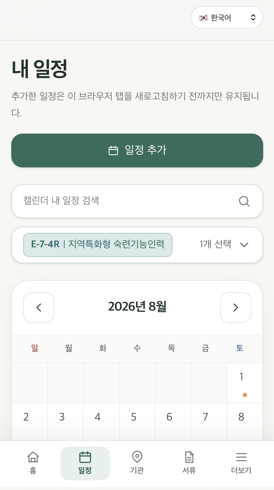

"일정 추가" 버튼을 누르면 이름·날짜·시간·위치와 카테고리(관공서 방문/비자 인터뷰·서류 제출/교육·상담 참석/직접 입력)를 지정할 수 있다.

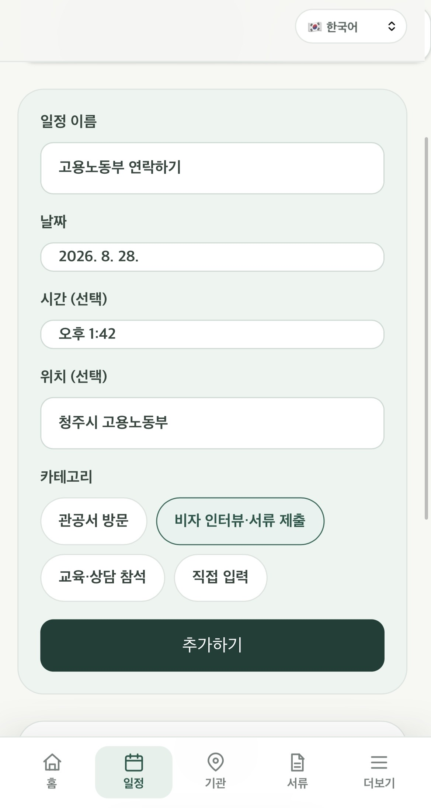

추가한 일정은 해당 날짜에 점으로 표시되고, 날짜를 누르면 하단에 상세 카드로 나타난다.

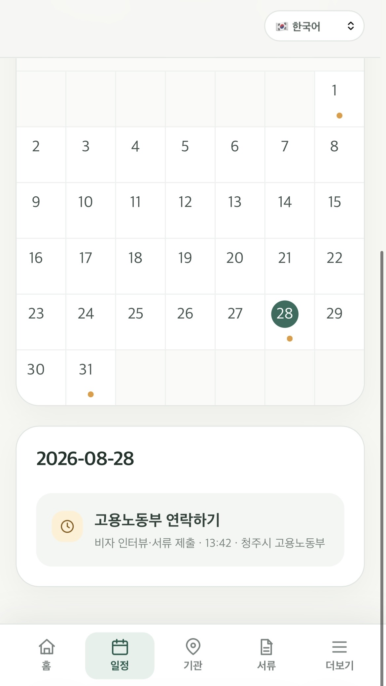

사용자가 직접 추가하지 않아도, 온보딩에서 선택한 비자(E-7-4R)의 공식 절차 마감일이 캘린더에 자동으로 표시된다.

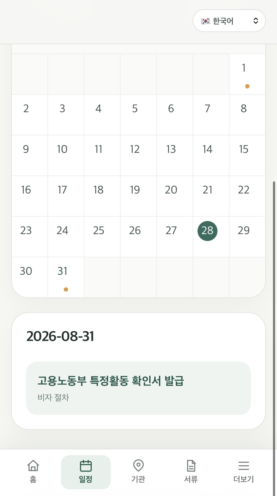

---

## 5. 기관 화면

사용자 주변에 어떤 지원 기관이 있는지 지도 위 마커로 확인할 수 있다. 위치 권한을 거부해도 지역(청주시 등)을 직접 선택할 수 있고, 주민센터·행정기관·대학 과사무실 등 기관 유형별로 필터링된다.

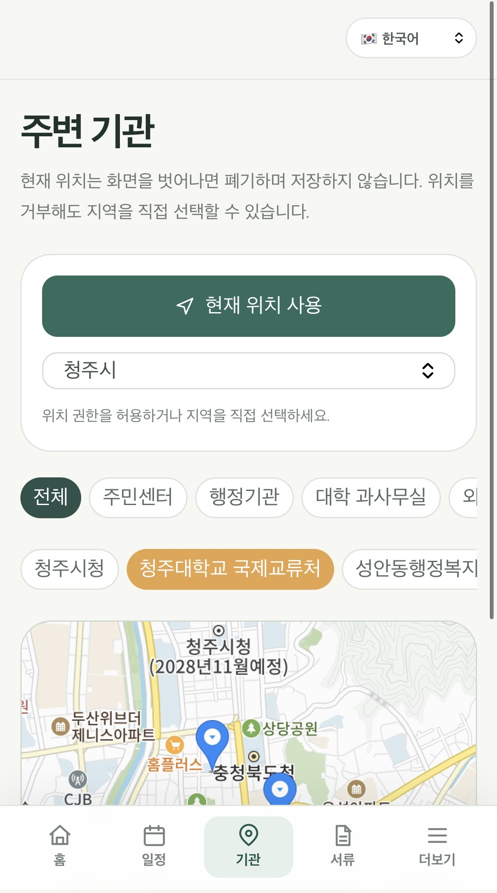

마커를 누르면 기관명·주소·전화번호·운영시간과 함께 "전화하기"·"길찾기" 버튼이 있는 상세 카드가 뜬다. "길찾기"를 누르면 카카오맵이 열리며 실제 길찾기가 실행된다.

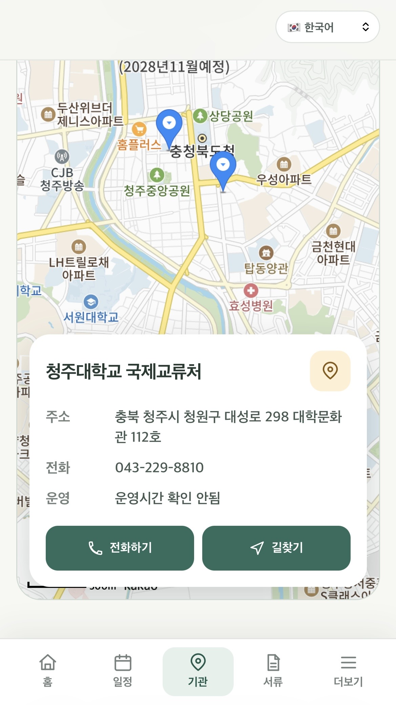

---

## 6. 서류 화면

서류 탭은 "① 비자신청서 작성 항목 점검"과 "② 비자 제출 서류 현황" 두 흐름으로 나뉜다.

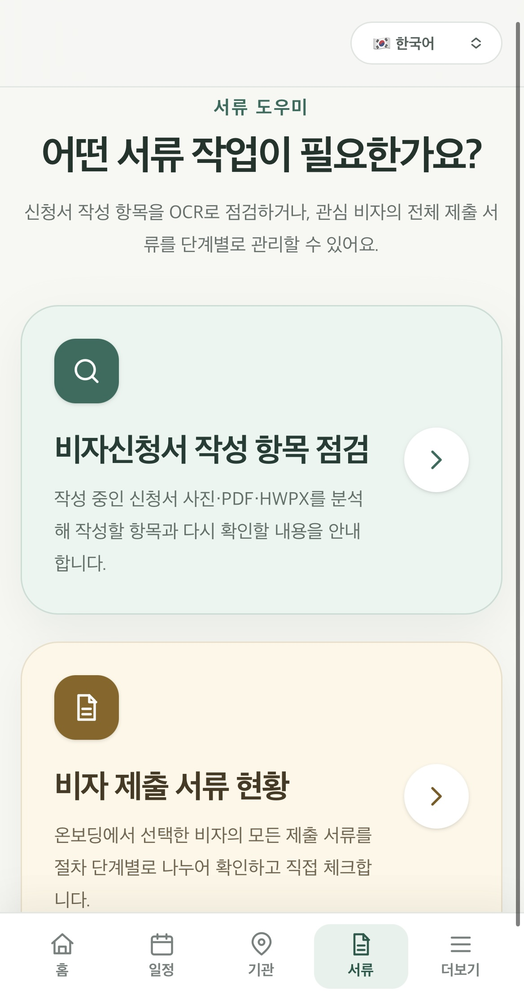

### 6-1. 비자신청서 작성 항목 점검 (OCR 흐름)

신청서 사진, PDF 또는 HWPX 파일을 준비해 "사진 촬영" 또는 "파일 첨부"로 등록한다. 현재 4개 서식을 인식할 수 있으며, 잘못 인식될 수 있어 종류를 알고 있으면 직접 선택하도록 안내한다.

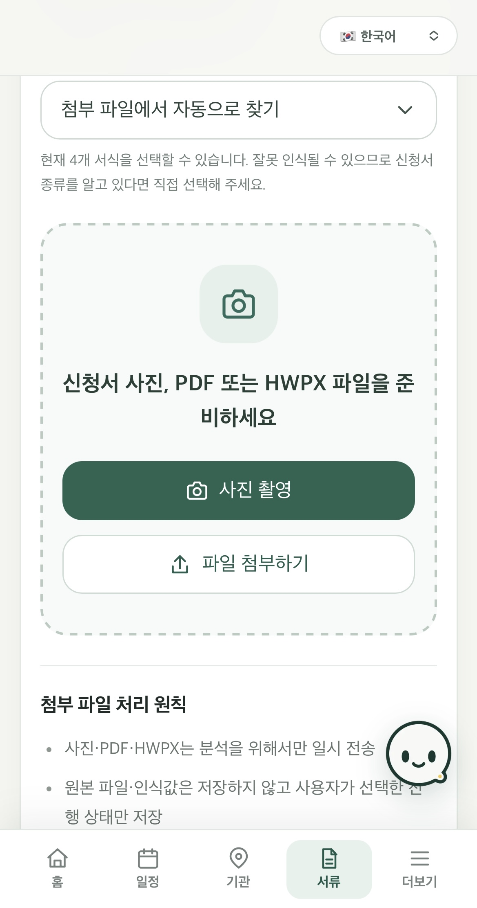

사진을 촬영하면 파일이 첨부되고, "분석할 준비가 되었습니다"라는 안내와 함께 "작성 항목 점검" 버튼이 활성화된다.

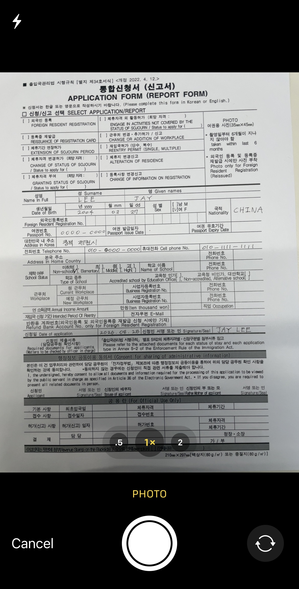
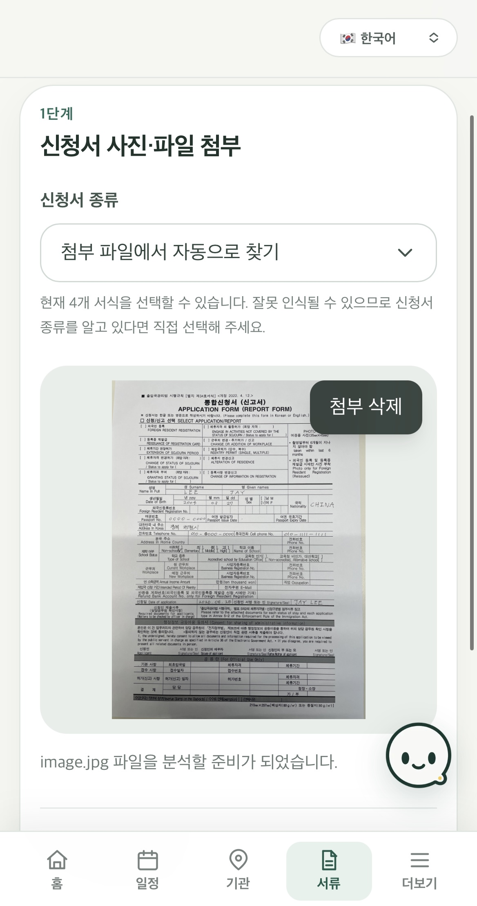

"작성 항목 점검"을 누르면 2단계로 넘어가 항목별 인식 결과를 인식 완료·확인 필요·작성 필요·직접 확인 4가지로 분류해 보여준다.

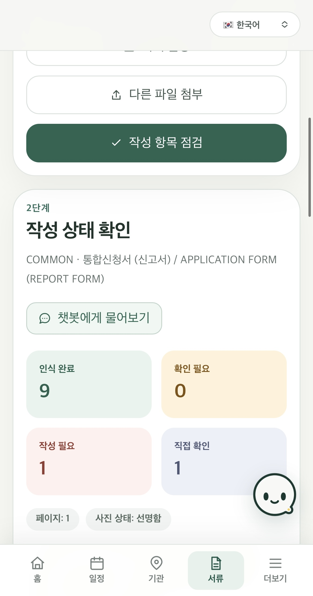
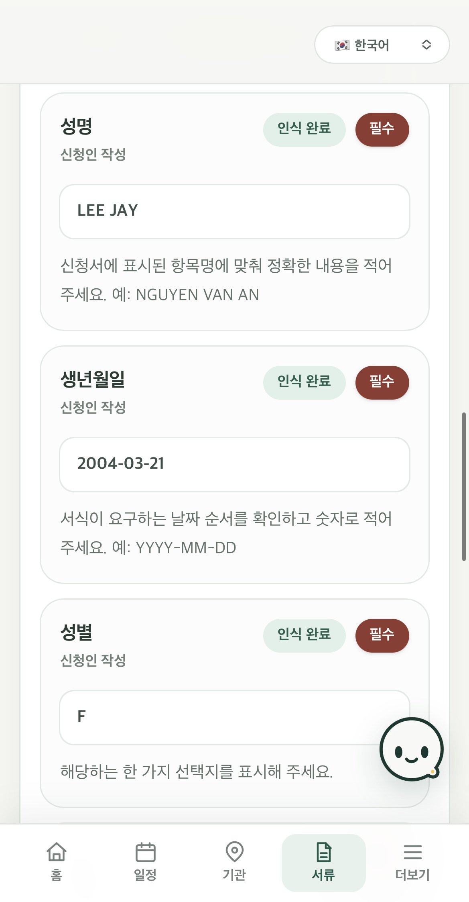

성명·생년월일·성별·국적·주소·휴대전화 등은 인식 결과를 보여주고 필요하면 직접 수정할 수 있게 하며, 서명·동의·기관 작성란은 OCR로 대신 채우지 않고 원본에 직접 작성하도록 안내한다. 첨부한 사진·PDF·HWPX는 분석을 위해서만 일시 전송되고, 원본 파일과 인식값은 저장하지 않으며 사용자가 선택한 진행 상태만 저장된다.

### 6-2. 비자 제출 서류 현황

온보딩에서 선택한 비자(E-7-4R 등)의 전체 제출 서류를 절차 단계별로 나누어 보여준다.

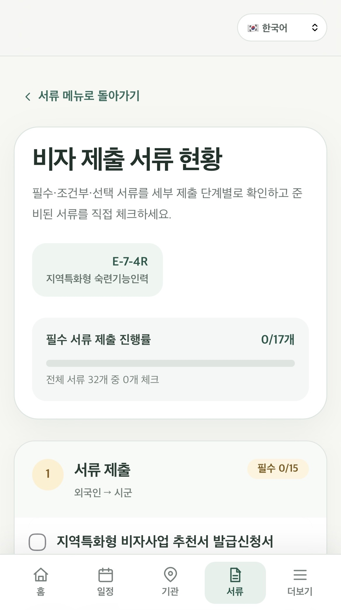
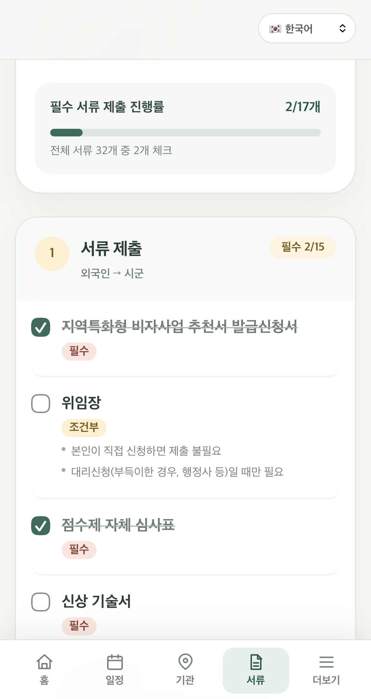

"1단계 서류 제출(외국인 → 시군)" 아래 지역특화형 비자사업 추천서 발급신청서·위임장·점수제 자체 심사표·신상 기술서·고용기업 추천서 등이 필수/조건부 태그와 함께 나열되고, 사용자가 준비된 서류를 직접 체크한다. 위임장처럼 "본인이 직접 신청하면 제출 불필요, 대리 신청일 때만 필요"와 같은 조건은 태그 아래 설명으로 표시된다.

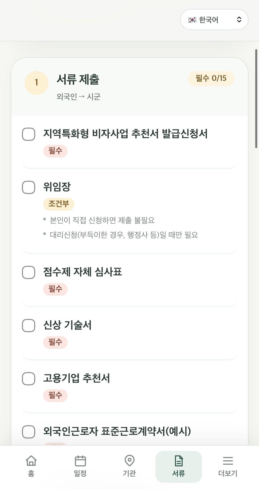

여기서 체크한 결과는 곧바로 홈 화면의 "준비 현황" 진행률과 "현재 단계" 컴포넌트에 반영된다.

---

## 7. 더보기

계정·언어·알림·약관 설정을 모아둔 화면이다.

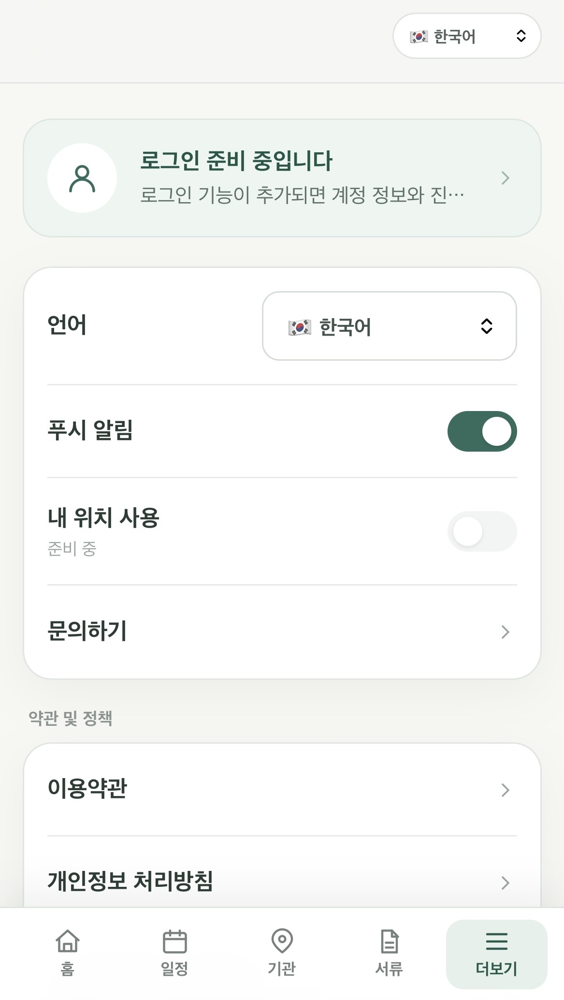
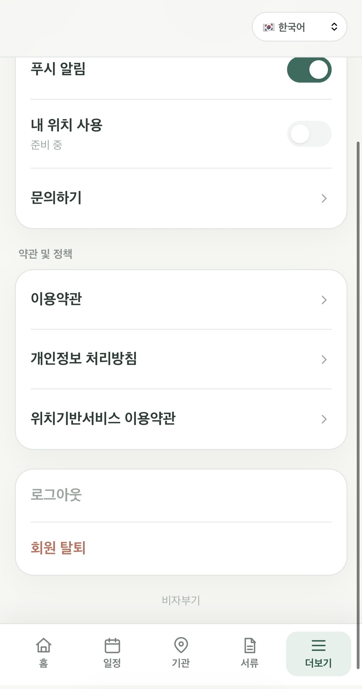

언어를 여기서도 바꿀 수 있고, 이용약관·개인정보 처리방침·위치기반서비스 이용약관을 확인할 수 있으며, 로그아웃과 회원 탈퇴도 이 화면에서 처리한다.

---

## 8. 번역 기능

화면 우측 상단의 언어 선택기를 누르면 6개 언어 목록이 드롭다운으로 뜬다.

O'zbekcha(우즈베크어)를 선택하면 카드 제목·버튼 문구·안내 문구를 포함한 홈 화면 전체가 즉시 우즈베크어로 바뀐다. "비자별 모집 현황" 카드의 실시간 수치("Qolgan o'rinlar 133 kishi", "Jami 311 o'rindan qolgan ulush")까지 그대로 번역되어, 정적 문구뿐 아니라 공고 수치를 담은 동적 데이터도 함께 다국어로 표시됨을 보여준다.

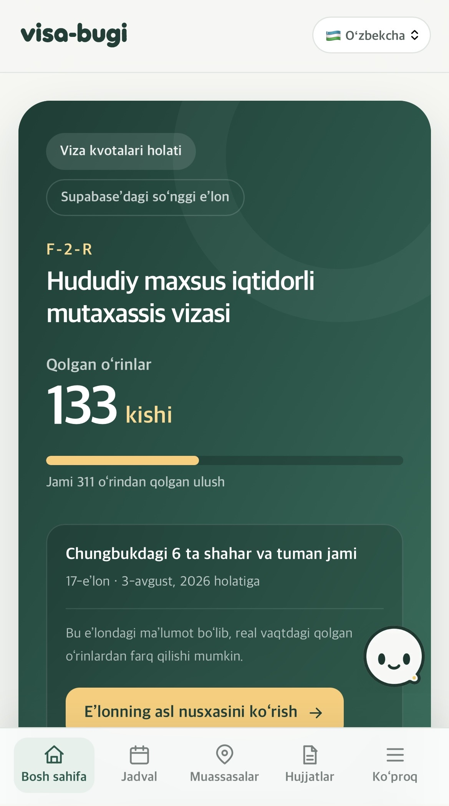

하단 탭 이름도 "Bosh sahifa(홈)·Jadval(일정)·Muassasalar(기관)·Hujjatlar(서류)·Ko'proq(더보기)"로 함께 번역되어, 온보딩에서 고른 언어가 앱 전체에 일관되게 적용됨을 확인할 수 있다.
