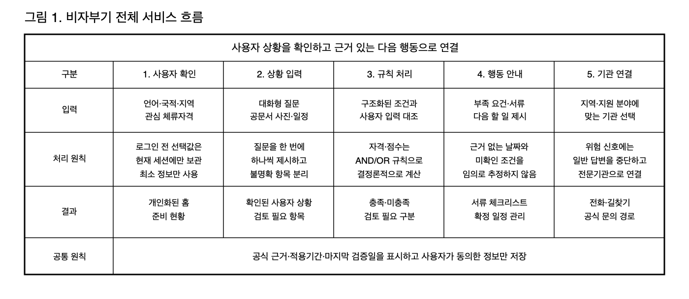
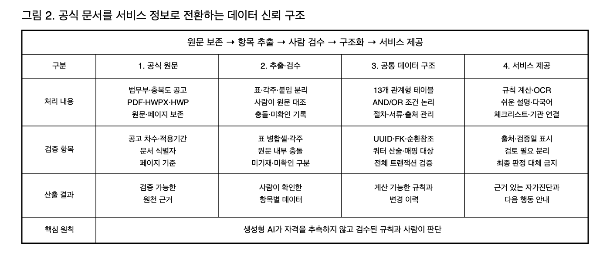
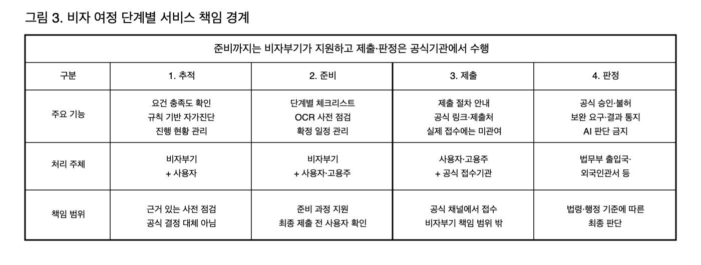
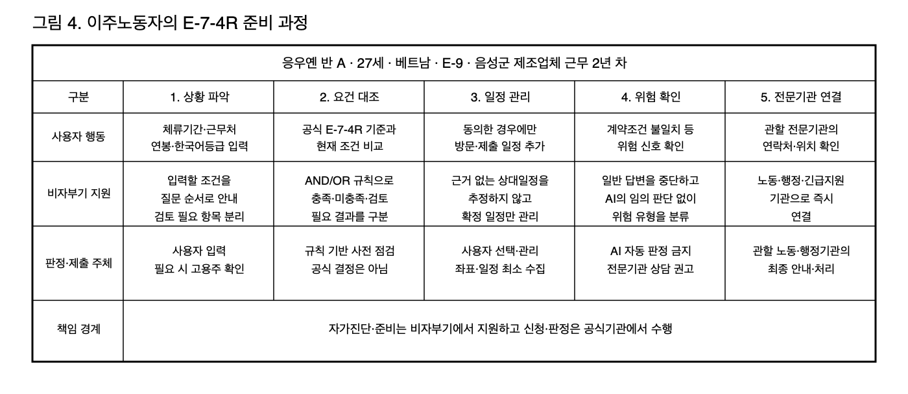
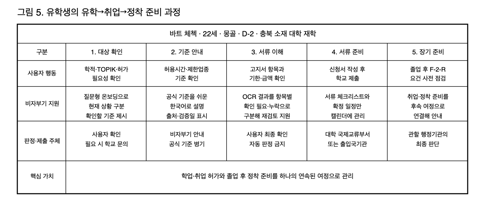
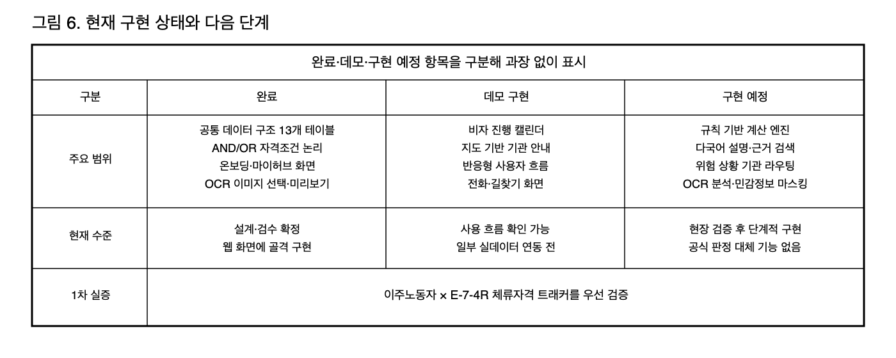

# 사업계획서 — 비자부기(visa-bugi)

> **문서 상태:** 참고용 초안이며 제출본이 아니다. 검증된 수치와 최종 표현은 `2026_ICT융합공모전_비자부기_사업계획서_최종안.docx`를 기준으로 한다.

- 참가 분야: 디지털 시제품
- 공모 분야: ② 충북 현안 해결 AI 혁신
- 작품명(사업명): 비자부기(visa-bugi)
- 신청인(팀장): 김태은
- 작성 기준일: 2026년 8월 26일

> 본 문서는 제13회 전국 ICT융합 공모전 제출용 사업계획서 초안이다. 통계·정책 자료는 신청 직전 최신 공고와 출처 원장을 기준으로 다시 확인하며, [출처 확인 필요] 표시는 최종 제출 전에 교체한다.

## 1. 요약

| 구분 | 내용 |
|---|---|
| 제품(아이디어)명 | **비자부기(visa-bugi)** |
| 제품(아이디어) 소개 | 이주노동자와 유학생을 위한 24시간 다국어 생활행정·체류자격 AI 서비스다. 충북 공고와 붙임서식을 개인별 요건·서류·일정으로 변환하고, 대화 안내·OCR 서류 점검·체류자격 트래커·캘린더를 연결한다. 준비가 끝나면 대한민국 비자포털·하이코리아 또는 관할기관의 공식 절차로 연결한다. |
| 제품(아이디어) 사업성 | 2026년 4월 기준 충북 외국인주민 8만 9,823명 가운데 이주노동자 2만 2,259명과 유학생 1만 4,303명은 합계 약 41%를 차지한다. 두 집단은 F-2-R·E-7-4R 등 지역특화형 비자의 잠재 대상자와 겹치며, 충북의 산업인력 확보와 인구감소지역 정착 정책에 직접 연결된다. [출처 확인 필요] |
| 제품(아이디어) 가치 | 공식 요건표를 구조화한 규칙 기반 계산 엔진이 자격과 점수를 결정론적으로 계산하고, RAG와 다국어 LLM은 근거 검색과 쉬운 설명을 보조한다. 일정과 이력은 사용자 동의가 있는 항목만 저장하며, 결과는 공식 판정이 아닌 참고용 자가진단으로 제공한다. |
| 제품(아이디어) 기대효과 | 제천·보은·옥천·영동·괴산·단양 등 충북 인구감소지역의 외국인 정착 전략 실행을 지원한다. 유학생의 체류자격 관리 실패와 미등록 체류 전환을 줄이고, 대학·기업·지원기관의 반복 상담과 서류 누락을 완화한다. |
| 관련 이미지 | [요건 충족률 대시보드 목업](assets/01-dashboard-mockup.png) |

## 2. 기획 배경

### 2-1. 숫자로 보는 충북의 특수성

2026년 4월 기준 충북 총인구는 159만 9,375명, 외국인주민은 8만 9,823명으로 도 전체의 약 5.5%다. 특히 음성군의 외국인 비율은 18.1%, 진천군은 13.9%로 제조업 밀집지역에서 외국인 주민이 지역 산업과 생활 기반의 중요한 구성원이 되었음을 보여준다. [출처 확인 필요]

2023년 통계청 기준 한국 국적을 보유하지 않은 외국인 가운데 근로자는 2만 2,259명으로 가장 많고, 외국국적동포 1만 3,320명, 결혼이민자 5,808명, 유학생 5,506명 순이다. 이 수치는 2023년 분류 통계이며, 2026년 4월 기준 충북 유학생 수 1만 4,303명과는 조사 시점과 기준이 다르다. 2026년 유학생 수는 전년 동기 1만 537명보다 약 35% 증가했다. [출처 확인 필요]

이주노동자와 유학생을 합하면 충북 외국인주민의 약 41%에 해당한다. 따라서 두 집단의 체류자격·생활행정 문제를 해결하는 것은 일부 사용자를 위한 편의 기능이 아니라 충북 외국인정책의 실효성을 높이는 핵심 과제다.

### 2-2. 이주노동자가 실제로 겪는 문제

이주노동자는 임금체불, 최저임금 미만 지급, 강제적립금, 산업재해, 장시간 노동, 신분증 압류, 사업장 변경 제한, 폭행·폭언과 차별대우에 노출될 수 있다. 고용허가제 아래에서 사업장 변경이 제한되는 구조는 피해를 인지해도 도움을 요청하거나 근무지를 옮기기 어렵게 만든다.

음성노동인권센터의 노동상담 사례에는 채용광고와 실제 근로계약 조건의 불일치가 반복적으로 등장한다. 이런 문제는 일반 행정 안내만으로 해결할 수 없으므로, 서비스가 위험 신호를 감지하면 AI가 독자적으로 판단하지 않고 노동인권센터·외국인근로자지원센터·고용노동부 등 검증된 전문기관으로 즉시 연결해야 한다.

### 2-3. 유학생이 겪는 문제와 충북의 맥락

유학생은 등록·성적·장학금 같은 학사 문제와 비자 갱신, 시간제취업 허가, 주거, 의료, 문화적응을 동시에 관리해야 한다. 충북은 ‘충북형 K-유학생 정책’을 추진하며 2027년까지 유학생 2만 명을 목표로 하고 있지만, 유치 이후 체류·취업·정착 과정을 개인별로 추적하는 통합 창구는 부족하다. [출처 확인 필요]

2024년 기준 유학생 출신 미등록 체류자는 3만 4,267명, 미등록 전환 비율은 11.6%로 제시된다. 출석률, 재정능력 입증, D-2에서 D-10으로 전환한 뒤의 취업처 확보 실패 등이 주요 원인으로 지적된다. [출처 확인 필요] 유학생이 행정기한과 요건을 놓치지 않도록 돕는 일은 대학의 학생지원뿐 아니라 충북의 장기 정착 전략과도 연결된다.

### 2-4. 지역특화형 비자와 인구소멸 대응의 접점

충북은 제천·보은·옥천·영동·괴산·단양 등 6개 인구감소지역에 외국인을 정착시키기 위해 F-2-R, E-7-4R, F-4-R 지역특화형 비자를 운영한다. E-7-4R은 숙련기능인력의 장기체류 경로를, F-2-R은 지역의 대학·기업과 연결된 우수인재의 정착 경로를 제공한다.

비자부기는 사용자가 자신의 현재 체류자격, 근무기간, 소득, 한국어능력 등을 공식 요건표와 대조하고 부족한 조건을 미리 준비하도록 돕는다. 이는 개인 편의를 넘어 충북도가 이미 추진 중인 인구감소지역 정착 전략의 실제 신청·전환 과정을 지원하는 것으로, 공모 분야 **② 충북 현안 해결 AI 혁신**에 직접 해당한다.

### 2-5. 기존 대응과 남은 빈칸

대한민국 비자포털은 비자 내비게이터, 체류자격별 공통 제출서류 안내, 전자비자 신청과 결과 조회를 제공한다. 하이코리아는 국내 체류 외국인의 전자민원, 방문예약, 민원 결과 조회를 담당한다. 두 서비스는 공식 신청과 민원 처리의 기준점이다. 충북의 ‘Study in Chungbuk’도 유학생을 위한 다국어 정보와 AI 번역 챗봇을 제공한다.

| 구분 | 공식 서비스의 역할 | 비자부기가 담당하는 준비 과정 |
|---|---|---|
| 대한민국 비자포털 | 비자 종류·공통 제출서류 안내, 전자비자 신청·결과 조회 | 충북 공고 차수별 요건을 개인별 준비 행동으로 변환 |
| 하이코리아 | 국내 체류 전자민원·방문예약·조회 | 민원 전에 필요한 요건·서류·일정을 지속해서 추적 |
| Study in Chungbuk | 유학생 중심 다국어 정보와 AI 번역 챗봇 | 근로자와 지역특화형 비자까지 규칙 계산·행동관리로 확장 |
| 비자부기 | 충북 공고 기반 신청 전 준비·추적 | 준비가 끝난 사용자를 공식 신청·민원 채널로 연결 |

비자부기는 충북 공고와 붙임서식을 계산 가능한 규칙으로 만들고, 이를 사용자의 체크리스트·OCR 결과·캘린더 일정으로 연결한다. 제출과 판정은 대한민국 비자포털, 하이코리아와 관할기관에서 수행한다. 따라서 비자부기의 역할은 공식 서비스를 복제하는 것이 아니라 사용자가 공식 절차를 시작할 수 있는 상태까지 준비하도록 돕는 데 있다.

## 3. 기획 세부설명

### Part 1. 서비스별 핵심 기능 및 기술 설명

#### 3-1. 전체 서비스 흐름

비자부기는 먼저 사용자가 이주노동자인지 유학생인지 확인하고, 대화·공문서 촬영·체류자격 확인 중 필요한 경로로 안내한다. 일반 행정 문의에는 공식 자료를 검색하는 RAG 기반 안내를, 자격 확인에는 규칙 기반 계산을, 위험 신호에는 전문기관 라우팅을 적용한다.



#### 3-2. 핵심 기능 7개

| 기능 | 설명 | 이주노동자 예시 | 유학생 예시 |
|---|---|---|---|
| ① 상황별 대화형 안내 | 필요한 정보를 순차 질문해 맥락을 파악한 뒤 맞춤 안내 | 증상과 보험 여부를 확인해 의료기관 안내 | 학적·TOPIK을 확인해 시간제취업 절차 안내 |
| ② 공문서 촬영 → 모국어 요약 | 공문서의 핵심 내용·기한·제출처를 추출해 쉬운 모국어로 설명 | 행정통지서 방치 방지 | 등록금·장학금 안내문 이해 지원 |
| ③ 서류 초안 작성·맞춤법 검사·제출처 연결 | 신청서 초안을 만들고 공식 제출처까지 연결 | 전입신고 등 생활행정 서식 | 시간제취업·체류지변경 서식 |
| ④ 이력 기반 능동 리마인더 | 사용자가 동의한 일정만 카테고리별로 저장하고 알림 | 체류지 변경 신고 기한 안내 | 비자 만료·등록금 일정 안내 |
| ⑤ 위험 키워드 감지와 전문기관 연결 | 위험 신호에는 일반 답변 대신 사전 검증된 기관 연결 | 체불·해고·산재·폭행 | 불법취업·출석미달·제적 |
| ⑥ 체류자격 점수·요건 트래커 | 공식 요건과 입력값을 대조해 충족·미충족·검토 필요와 보완 방법 제시 | E-7-4R 전환 준비 | 졸업 후 F-2-R 준비 |
| ⑦ 단계별 피드백 집계 | 여정별 어려움을 비식별·집계해 정책 개선 근거로 제공 | 한국어능력 요건 병목 파악 | 재정증빙 준비의 어려움 파악 |

#### 3-3. 핵심 기술과 데이터 기반

| 기술 | 역할 |
|---|---|
| 다국어 LLM | 순차 질문, 쉬운 설명, 서류 초안 작성을 보조 |
| OCR | 공문서 이미지에서 텍스트를 추출 |
| RAG | 검수된 행정서식·안내문·담당기관을 근거로 답변 |
| 벡터DB 기반 이력관리 | 동의한 대화·서류 맥락을 다음 문의와 리마인더에 활용 |
| 규칙 기반 계산 엔진 | 공식 요건표와 사용자 입력을 결정론적으로 대조 |
| 키워드 감지·규칙 기반 라우팅 | 노동·학사 위험 신호를 전문기관 연결 경로로 전환 |

계산 엔진의 데이터 기반은 visa-data 저장소에서 설계·검수한 공통 데이터 구조다. 서비스 코어 10개와 근거·이관용 3개를 합친 13개 테이블에서 비자 기본정보, AND/OR 자격조건 논리 트리, 개별 조건, 절차, 제출서류와 근거 문서를 관리한다. 여러 대체 경로는 OR 그룹으로, 동시에 충족해야 하는 조건은 AND 그룹으로 표현해 LLM이 아닌 구조화된 규칙 트리가 충족 여부를 계산한다.



#### 3-4. 안전장치

- 계산은 공식 요건표를 구조화한 규칙 기반 엔진만 수행하고, LLM은 자연어 입력을 구조화하거나 결과를 쉽게 설명하는 역할로 제한한다.
- 원문·페이지·적용기간·마지막 검증일을 결과와 함께 표시하고, 요건표는 법무부와 충북도 공고를 기준으로 갱신한다.
- 화면에 “본 결과는 참고용이며, 최종 신청 전 관할 담당부서 또는 출입국·외국인사무소에서 확인해야 합니다”라는 안내를 상시 표시한다.
- 요건을 충족해도 AI가 신청을 단정적으로 권유하지 않고, 담당기관에 정확한 절차를 확인하도록 안내한다.
- OCR 원본과 여권번호·주소 등 민감정보는 장기 저장을 기본값으로 두지 않는다.

#### 3-5. 서비스 범위와 책임 경계

| 구분 | Tier 1: 직접 구축 | Tier 2: 설명·연결 |
|---|---|---|
| 범위 | ⑥ 체류자격 트래커, ③ 체류·행정 서식 | 건강, 직장 내 괴롭힘, 보험 등 생활 전반 |
| 역할 | 요건 계산, 체크리스트, 서류 초안 | 상황 파악, 다국어 설명, 전문기관 연결 |
| 데이터 | 비자별 요건표와 서식 직접 관리 | 이슈 유형별 기관 라우팅표 관리 |



제출과 판정은 법적 구속력이 있는 행정행위이며 오판이 체류상 불이익으로 이어질 수 있다. 따라서 비자부기는 추적과 준비를 지원하되 제출과 판정은 항상 공식 채널로 넘긴다.

대한민국 비자포털에도 비자 내비게이터가 있으므로 비자 추천은 보조 기능으로 둔다. 비자부기는 충북 지역특화형 비자의 공고 차수, 적용기간, AND/OR 조건, 점수, 첨부서류 관계를 구조화하고 사용자가 준비해야 할 일을 계속 추적하는 데 집중한다.

### Part 2. 시나리오별 사용자 여정

> 아래 두 인물은 실제 개인이 아닌 가상 시나리오이며, 기존 기획안의 타깃 페르소나를 기반으로 한다.

#### 페르소나 A — 응우옌 반 A

27세 베트남 국적의 응우옌 반 A는 E-9 체류자격으로 음성군 대소읍 제조업체에서 3교대로 근무한 지 2년이 됐다. 근로계약서와 실제 근무조건이 다르지만 어디에 문의할지 모르고, 장기체류자격 전환 가능성도 확인하지 못한 상태다.

1. ① 상황별 대화형 안내가 체류기간·근무처·연봉·한국어등급을 순차적으로 확인한다.
2. ⑥ 체류자격 트래커가 E-7-4R 공식 요건과 대조하고 부족한 항목과 준비 방법을 보여준다.
3. ④ 능동 리마인더가 “이 건을 캘린더에 추가할까요?”라고 묻고, 동의한 경우에만 체류자격 일정으로 저장한다.
4. 사용자가 “근로계약서와 실제 조건이 다르다”고 입력하면 ⑤ 위험 감지가 추적 동의 여부와 관계없이 노동인권센터·외국인근로자지원센터·고용노동부로 연결한다.



#### 페르소나 B — 바트 체첵

22세 몽골 국적의 바트 체첵은 충북 소재 대학에 재학 중인 D-2 유학생이다. 시간제취업 허가 절차를 모르고 아르바이트를 시작할 뻔했으며, 졸업 후 충북에 남기 위해 어떤 체류자격을 준비해야 하는지도 알지 못한다.

1. “아르바이트를 하고 싶어요”라는 질문에 ① 대화형 안내가 학적과 TOPIK 등급을 확인한다.
2. 공식 기준에 따라 허용시간과 제한업종을 안내하고, 확인이 필요한 조건은 대학 국제교류처로 연결한다.
3. 등록금 고지서를 촬영하면 ② 공문서 요약이 핵심 금액·기한·제출처를 모국어로 설명한다.
4. ③ 서류 초안 기능이 시간제취업 허가 신청서 준비를 돕고 대학 담당부서로 연결한다.
5. ⑥ 트래커가 졸업 후 F-2-R 전환에 필요한 학력·한국어능력 등 준비 항목을 미리 보여준다.



두 페르소나는 대화로 상황을 파악하고, 트래커로 자가진단한 뒤, 필요에 따라 서류 준비 또는 위험 대응을 거쳐 공식기관으로 연결되는 공통 흐름을 따른다. 이는 Tier 1과 Tier 2의 역할 구분 및 추적→준비→제출→판정의 책임 경계가 실제 사용자 경험에서 작동하는 방식이다.

## 4. 제품(아이디어) 실현 방안

### 4-1. 시제품 구현 현황

비자부기 웹 시제품은 메인 브랜치 기준으로 온보딩, 비자 준비 대시보드, 챗봇, 서류 OCR, 캘린더, 기관 지도, 다국어 화면을 하나의 사용자 흐름으로 연결해 둔 상태다. 사용자는 언어와 지역, 관심 비자를 선택한 뒤 현재 준비 단계와 다음 서류를 확인하고, 필요한 경우 챗봇이나 기관 안내로 이동할 수 있다.

| 구현 영역 | 메인 브랜치에 반영된 내용 | 사용자에게 보이는 결과 |
|---|---|---|
| 온보딩·홈 | 언어·지역·관심 비자 선택, 목표 비자 변경, 진행률·현재 단계·다음 서류 표시 | 로그인 전에도 기본 선택을 시작하고, 선택한 비자 기준의 준비 화면 확인 |
| 비자 준비 데이터 | Supabase의 비자·절차 단계·서류 요건을 조회하고 유효기간을 확인하며, 연결이 없을 때는 미리보기 데이터로 화면을 유지 | F-2-R·E-7-4R·F-4-R·D-2의 단계별 서류와 공고 유효기간 확인 |
| 챗봇·위험 라우팅 | 질문을 위험유형·사용자 유형·지역·비자 코드로 먼저 분류한 뒤, 비자 요건·절차·서류·쿼터·기관 조회 도구를 제한적으로 호출 | 일반 질문은 근거 데이터 기반으로 안내하고, 임금체불·산재·폭행·불법취업 등은 확인된 전문기관 연락처로 연결 |
| 신청서 OCR | 통합신청서, F-2-R 추천서 발급 신청서, E-7-4 자체 심사표 등 서식별 필드 정의와 이미지 품질 점검, PDF·HWPX 업로드 지원 | 추출 결과를 ‘완성·확인 필요·누락·수동 확인’으로 보여주고 제출 전 재검토 유도 |
| OCR 결과 저장 | 인증 사용자의 검토 상태와 필드 결과만 저장하고 원본 파일은 장기 보관하지 않음 | 다음에 이어서 확인할 수 있는 서류 상태 제공 |
| 일정·기관 | 체크리스트 캘린더, 청주·충주·진천·음성 지역 선택, GPS 위치를 약 1km 단위로 낮춘 기관 조회, 전화·길찾기 연결 | 확정된 준비일을 관리하고 가까운 행정·교육·노동 지원기관 확인 |
| 다국어·접근성 | 한국어·중국어·베트남어·우즈베크어·네팔어·크메르어 UI, 키보드 포커스와 모션 감소 등 처리 | 한국어가 익숙하지 않은 사용자도 같은 준비 절차 이용 |

챗봇과 OCR은 외부 AI의 답변을 그대로 판정에 사용하지 않는다. 챗봇은 검수된 데이터 조회와 위험상황 연결을 담당하고, OCR은 서식 필드 추출 뒤 결정론적 검토 로직을 거친다. 따라서 시제품 시연에서는 ‘질문 입력 → 필요한 데이터 조회 → 다음 행동 제시’와 ‘서식 업로드 → 필드별 상태 확인 → 공식 제출 경로 안내’를 핵심 장면으로 보여준다.



### 4-2. 데이터·AI 처리 구조와 책임 경계

웹앱은 원천문서를 직접 수정하지 않고, `visa-data`에서 추출·검수한 데이터를 Supabase로 조회한다. 공식 문서는 원문과 근거 정보로 보존하고, 서비스에서는 비자 요건·절차 단계·서류·쿼터·기관 연락처를 서로 연결해 사용한다. 이 구조 덕분에 챗봇이 답변을 만들 때도 임의의 문서를 검색하는 대신 허용된 조회 도구를 통해 필요한 행만 확인할 수 있다.

```text
[공식 공고·서식]
        ↓ 추출·사람 검수·변경 기록
[visa-data 근거 데이터]
        ↓ Supabase 적재·유효기간 확인
[웹앱 조회 계층]
   ┌──────┼────────┬─────────┐
   ↓      ↓        ↓         ↓
 챗봇   비자 준비  OCR 검토  일정·기관
 라우팅 대시보드  필드상태  안내
```

챗봇은 먼저 질문의 의도와 위험 신호를 분류한다. 비자·절차 질문은 필요한 조회 도구만 사용하고, 조회 결과가 없으면 추측하지 않고 지원기관을 안내한다. 위험 신호가 감지되면 일반적인 조언보다 `risk_routing`에 등록된 기관과 연락처를 우선 제시한다. 연락처는 허용된 데이터에서만 가져오며, 확인되지 않은 번호를 생성하지 않는다.

OCR은 서식별 필드 목록과 작성 주체를 먼저 정한 뒤 이미지 또는 PDF·HWPX에서 값을 추출한다. 이후 필수 여부, 날짜·숫자 형식, 서명·동의란의 수동 확인 필요 여부를 규칙으로 검사한다. OCR 결과는 참고용이며 비자 자격이나 서류의 법적 효력을 판정하지 않는다.

### 4-3. 예상 문제와 해결 방안

| 위험 | 해결 방안 |
|---|---|
| 요건표 개정 | 운영 단계에서는 공식 게시판에 새 공고가 등록되면 수집 모듈이 원문 파일을 내려받고 PDF·HWPX·HWP 파싱 작업을 실행한다. 이전 차수와 변경 내용을 비교한 뒤, 파싱 오류나 원문 충돌이 없는 항목만 사람 검수를 거쳐 서비스 데이터에 반영한다. 공고별 적용기간과 차수 이력도 함께 관리한다. |
| 개인정보 노출 | 사용자가 동의한 자료만 처리하고 OCR 원본과 민감정보를 장기 저장하지 않으며, 원본 발급은 정부24 등 공식 채널로 연결 |
| 정부 시스템 미연동 | 체크리스트→공식 딥링크→사용자 완료확인의 3단계 패턴으로 대체 |
| 계산 오판정 | 규칙 기반 계산, 근거 표시, 검토 필요 분리, 사람 확인 원칙 적용 |
| 다국어 번역 오류 | 핵심 행정용어집, 원문 병기, 언어별 전문 검수와 버전 관리 |

### 4-4. 적용처와 사업화

1차 실증지역은 제조업 이주노동자가 많은 음성·진천과 유학생이 밀집한 청주·충주로 설정한다. 개인 사용자에게 핵심 자가진단·체크리스트·기관 연결을 제공하고, 이후 대학·기업·지자체에는 기관별 안내, 공고 변경 알림, 담당자 검수와 집계형 운영 기능을 제공하는 B2C 기반 B2G/B2B 모델로 확장한다.

이후 결혼이민자와 외국국적동포까지 대상자를 넓힌다. 기관 도입 단계에서는 개인을 식별하지 않는 집계 자료로 어느 준비 단계에서 지원이 필요한지 확인하고, 기존 외국인정책·비자 지원사업을 보완하는 데 활용한다.

사업화 운영 흐름은 다음과 같다.

```text
[대학·기업·지자체]
     연간 사용료·운영비 부담
             ↓
       [비자부기 운영]
     공고 갱신·AI 처리·검수
             ↓
      [외국인 주민 이용]
       무료 요건·서류·일정 준비
        ↓
        [충북 지역 편익]
    비자 전환 이탈 감소·인력 유지·정착
```

### 4-5. 개발 로드맵과 성과 측정

| 단계 | 기간(안) | 주요 내용 | 완료 기준 |
|---|---|---|---|
| 1단계 | 2026.09~11 | 현재 웹 기능과 검수 데이터 연결 보강, E-7-4R 규칙·챗봇·OCR·공고 갱신 흐름 점검 | 자동·검토 필요·안내용 결과가 화면에서 구분되고 근거가 표시됨 |
| 2단계 | 2026.11~2027.02 | 외국인 유학생·근로자와 상담자 현장 테스트 | 요건 확인 성공률, 서류 누락률, 정보 탐색시간, 기관 연결률 측정 |
| 3단계 | 2027.03 이후 | 운영자 검수 화면, 기관별 안내·통계, 대학·기업·지자체 도입 | 유료 실증 또는 협약기관 확보 |

개발 단계는 다음 순서로 진행한다.

```text
[1단계 시제품 고도화]
2026.09~11 · 규칙·챗봇·OCR·공고 갱신 흐름 점검
             →
[2단계 현장 실증]
2026.11~2027.02 · 유학생·근로자·상담자 테스트
             →
[3단계 기관형 확장]
2027.03 이후 · 운영자 검수·통계·기관 도입
```

실증 목표는 비자 요건 확인 과업 성공률 85% 이상, 필수서류 누락률 30% 감소, 정보 탐색시간 40% 단축, 공식 출처 확인 가능률 100%다. 이 수치는 현재 실적이 아닌 검증 목표이며, 실증 전에 표본과 비교 조건을 확정한다.

## 5. 기대효과 및 활용분야

### 5-1. 충북에 미칠 기대효과

비자부기는 취업 이후의 비자 전환과 거주·행정 절차를 이어서 안내한다. 외국인 유학생과 근로자가 정보 부족으로 전환 시기를 놓치거나 지역을 떠나는 일을 줄이는 데 목적이 있다. 고용주 서류와 신청자 서류를 구분해 제공하므로 중소기업 담당자의 행정 탐색 부담도 낮출 수 있다.

기관이 부담하는 AI 처리비와 데이터 운영비는 외국인 주민에게 무료 비자 준비 기능을 제공하는 데 사용한다. 적은 처리비로 서류 누락과 일정 지연을 줄이고, 그 편익을 충북 기업의 인력 유지와 지역 정착으로 돌려주는 구조다.

### 5-2. 사회·경제적 파급효과

외국인 주민이 이해할 수 있는 언어로 필요한 절차와 준비서류를 확인하면 행정 정보격차를 줄일 수 있다. 특히 별도 인사 담당자가 없는 중소기업의 외국인 근로자, 한국어가 익숙하지 않은 유학생과 근로자처럼 본인이 비자 절차를 직접 챙겨야 하는 경우 효과가 크다. 준비 과정에서 누락된 서류나 놓친 기한을 미리 확인하면 신청 지연으로 인한 출근·근무 공백, 기관 재방문, 서류 재발급에 드는 시간과 비용을 줄일 수 있다. 대학과 지원기관은 같은 기준으로 보완사항을 안내할 수 있어 상담 편차도 낮아진다.

비자부기는 결과 화면마다 근거 문서와 페이지, 적용기간, 마지막 검증일을 표시하고, 원문 충돌이나 담당기관 판단이 필요한 항목은 ‘검토 필요’로 남긴다. 자격·점수 계산은 검수된 규칙으로 처리하고 최종 신청과 판정은 공식기관에 맡긴다. 이 운영 방식은 답변의 근거와 한계를 함께 공개하는 책임 있는 공공 AI 활용 사례가 되며, 향후 다른 체류·행정 서비스에도 같은 검수 구조를 적용할 수 있다.

### 5-3. 기타 활용분야

타 지자체 지역특화형 비자 플랫폼, 대학 유학생 관리, 기업 외국인 인력 온보딩, 외국인지원기관 상담 보조, 행정문서 변경 모니터링, 쉬운 행정정보·다국어 콘텐츠로 확장할 수 있다.

비자부기는 외국인 주민의 질문, 서류, 공고 일정을 한곳에서 관리한다. AI가 질문의 맥락을 파악하고 OCR이 서류 상태를 확인한다. 충북 공고를 개인별 준비 행동으로 바꾸고, 위험 신호에는 전문기관을 우선 안내하며, 준비가 끝난 사용자는 공식 신청·민원 채널로 연결한다.

## 참고자료 및 출처

- 법무부 출입국·외국인정책본부, 「체류외국인」 주요통계, 2025년 말 기준: https://immigration.go.kr/moj/2412/subview.do
- 법무부 출입국·외국인정책본부, 「2025년 6월 출입국·외국인정책 통계월보」: https://www.immigration.go.kr/bbs/immigration/227/483375/download.do
- 충청북도, 「충북 지역특화형 비자 사업 숙련기능인력(E-7-4R) 모집 공고(2026년 6차)」, 2026.06.09: https://www.chungbuk.go.kr/www/selectGosiPblancView.do?key=422&no=68707
- 충청북도, 「충북도, 도-시·군 외국인정책 협력회의 개최」, 2026.04.08: https://www.chungbuk.go.kr/www/selectBbsNttView.do?bbsNo=65&key=429&nttNo=418682
- 충청북도, 「충청북도 외국인 유학생 채용박람회」 관련 보도자료, 2026: https://www.chungbuk.go.kr/www/selectBbsNttView.do?bbsNo=65&key=429&nttNo=420176
- 대한민국 비자포털, 「비자 내비게이터·전자비자 및 비자발급인정서 안내」: https://www.visa.go.kr/openPage.do?MENU_ID=1020502
- 하이코리아, 「전자민원·방문예약·조회 서비스」: https://www.hikorea.go.kr/
- 비자부기 팀, visa-data 공통 데이터 구조 및 공고 원문 추출·검수 자료, 2026.08.26 기준.
- 비자부기 팀, visa-bugi-web 저장소 구현 상태, 2026.08.26 기준.

## 최종 편집 체크리스트

- [ ] [출처 확인 필요] 수치의 원문 URL·발행일·확인일을 출처 원장에 기록하고 본문 각주에 반영
- [ ] SVG 시각자료를 PNG로 내보내 HWP의 해당 위치에 삽입
- [ ] 구현 상태를 제출 직전 두 저장소의 최신 코드와 다시 대조
- [ ] 팀원 역할·보유역량·인터뷰·협약 실적이 있으면 4장에 추가
- [ ] 목표 수치를 현재 실적으로 오해할 수 없도록 표시
- [ ] 전체 15쪽 이내, 본문 11pt·줄간격 160 기준으로 최종 편집
